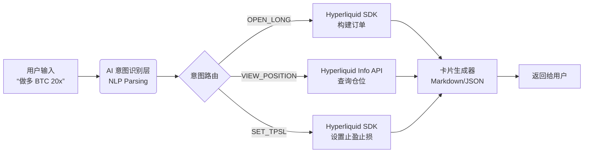

# AI Agent × Hyperliquid 意图交易与卡片实现路径

> **目标**：让 AI Agent 识别用户自然语言交易意图，通过 Hyperliquid SDK 执行合约操作，并向用户返回结构化的交易/仓位卡片。
> **受众**：AI Agent 开发同事（对 Hyperliquid 业务不熟悉）
> **前置条件**：Agent 持有用户的 EVM 地址，可访问 Hyperliquid Info API。
> 
> **交叉参考**：
> 
> - `docs/hyperliquid-info-api-direct.md`
> - `docs/Feature_HyperliquidAIAgentIntent.zh-CN.md`

---

## 1. 核心架构



---

## 2. 业务概念速通（必读）

| 术语                | 含义        | 备注                          |
|:----------------- |:--------- |:--------------------------- |
| **Asset**         | 交易标的      | BTC=0, ETH=1                |
| **Position**      | 仓位        | 包含方向、杠杆、数量                  |
| **Size (sz)**     | 合约张数      | **注意：不是 USDC 金额**           |
| **Reduce Only**   | 仅减仓       | 用于平仓或 TPSL                  |
| **TPSL**          | 止盈止损      | 本质是 `reduce_only=true` 的限价单 |
| **Clearinghouse** | 清算所       | 查询仓位和余额的核心 API              |
| **One-way only**  | 当前只支持单向仓位 | **不支持同币种同时多空双向持仓**          |

---

## 3. AI 意图识别规范

### 3.1 意图分类

Agent 需要将用户输入解析为以下结构化 JSON：

```json
{
  "intents": [
    "OPEN_LONG",      // 开多
    "OPEN_SHORT",     // 开空
    "CLOSE_POSITION", // 平仓
    "SET_TPSL",       // 设置止盈止损
    "VIEW_POSITION"   // 查看仓位
  ]
}
```

### 3.2 解析示例

| 用户输入 (User Input)        | AI 输出 (Structured Intent)                                                      |
|:------------------------ |:------------------------------------------------------------------------------ |
| "做多 BTC 20x 1000u"       | `{ "action": "OPEN_LONG", "asset": "BTC", "leverage": 20, "usdc_size": 1000 }` |
| "平掉 ETH 仓位"              | `{ "action": "CLOSE_POSITION", "asset": "ETH" }`                               |
| "BTC 设止盈 45000 止损 42000" | `{ "action": "SET_TPSL", "asset": "BTC", "tp": 45000, "sl": 42000 }`           |

---

## 4. 技术实现路径

### Step 1: 依赖安装

```bash
pip install hyperliquid-python-sdk web3
```

### Step 2: 初始化客户端

```python
from hyperliquid.info import Info
from hyperliquid.utils import constants

# 只读客户端（用于查询仓位、行情）
info = Info(constants.MAINNET_API_URL, skip_ws=True)

# 交易客户端（需要用户签名，Agent 代操作用）
# exchange = Exchange(wallet, constants.MAINNET_API_URL)
```

### Step 3: 意图 → 订单参数

```python
def build_order_params(intent: dict, user_address: str) -> dict:
    asset = intent["asset"]  # BTC / ETH

    if intent["action"] == "OPEN_LONG":
        return {
            "coin": asset,
            "is_buy": True,           # True = 做多
            "sz": calc_contract_size(intent["usdc_size"], asset), # 关键：换算张数
            "limit_px": 0,            # 0 = 市价单
            "order_type": {"limit": {"tif": "Ioc"}},
            "reduce_only": False,
            "leverage": intent["leverage"]
        }

    elif intent["action"] == "SET_TPSL":
        # TPSL 是独立的 Reduce Only 订单
        return {
            "coin": asset,
            "is_buy": False,          # 平多仓
            "sz": get_current_position_size(user_address, asset),
            "limit_px": intent["tp"], # 或 sl
            "order_type": {"limit": {"tif": "Gtc"}},
            "reduce_only": True       # ★ 关键标志
        }
```

> 注意：
> 
> - 如果你的执行器对齐当前 app 结构，`leverage` / `margin mode` 应先单独检查并更新，再下单
> - 不要把 `usdc_size` 直接当作 Hyperliquid 的 `sz`
> - 当前产品只支持 **one-way** 仓位模型

### Step 4: 查询仓位信息 (Info API)

```python
import requests

def get_position_card_data(user_address: str, asset: str) -> dict:
    """获取用于渲染卡片的仓位数据"""
    response = requests.post(
        "https://api.hyperliquid.xyz/info",
        json={
            "type": "clearinghouseState",
            "user": user_address,
        },
        timeout=10,
    )
    response.raise_for_status()
    state = response.json()

    for pos in state.get("assetPositions", []):
        if pos["position"]["coin"] == asset:
            p = pos["position"]
            return {
                "size": float(p["szi"]),
                "entry_price": float(p["entryPx"]),
                "leverage": float(p["leverage"]["value"]),
                "pnl": float(p["unrealizedPnl"]),
                "liq_price": float(p["liquidationPx"])
            }
    return None
```

### Step 5: 查询当前杠杆 / 保证金模式（MyDex Backend）

```python
def get_user_margin_setting(backend_base_url: str, user_address: str, asset: str) -> dict:
    response = requests.get(
        f"{backend_base_url}/perps-api/info/get-user-margin-setting",
        params={
            "walletAddress": user_address,
            "coin": asset,
        },
        timeout=10,
    )
    response.raise_for_status()
    result = response.json()
    return result["data"]
```

### Step 6: 查询用户未成交订单 (Info API)

```python
def get_frontend_open_orders(user_address: str) -> list[dict]:
    response = requests.post(
        "https://api.hyperliquid.xyz/info",
        json={
            "type": "frontendOpenOrders",
            "user": user_address,
        },
        timeout=10,
    )
    response.raise_for_status()
    return response.json()
```

---

## 5. 交易卡片 UI 规范 (Markdown)

### 5.1 开仓确认卡片

```markdown
🚀 **开仓预览**

**交易对**: BTC/USDC
**方向**: 📈 做多
**杠杆**: 20x
**保证金**: 1,000 USDC

🎯 **止盈止损**
• TP: $45,000
• SL: $42,000

⚠️ **风险**
• 强平价: $41,200

[✅ 确认开仓] [❌ 取消]
```

### 5.2 仓位信息卡片

```markdown
📊 **BTC 永续仓位**

├── 方向: 📈 做多
├── 仓位: 0.5 BTC
├── 开仓价: $43,000
├── 现价: $44,200
└── 未实现盈亏: **+$600 (+12%)**

[🔄 刷新] [📉 平仓] [⚙️ 修改TPSL]
```

---

## 6. 风控与安全（⚠️ 重点）

### 6.1 交易前检查

```python
def pre_trade_check(user_address, intent):
    # 1. 账户状态与可用保证金检查
    response = requests.post(
        "https://api.hyperliquid.xyz/info",
        json={
            "type": "clearinghouseState",
            "user": user_address,
        },
        timeout=10,
    )
    response.raise_for_status()
    user_state = response.json()
    if float(user_state["withdrawable"]) < intent["usdc_size"]:
        raise Exception("保证金不足")

    # 2. 当前仓位检查（当前只支持 one-way）
    position = get_position_card_data(user_address, intent["asset"])
    if position and intent["action"] in ["OPEN_LONG", "OPEN_SHORT"]:
        raise Exception("该币种已有仓位，当前只支持 one-way，不能直接再开新方向仓位")

    # 3. 当前杠杆 / 保证金模式检查（通过我方后端）
    margin_setting = get_user_margin_setting(BACKEND_BASE_URL, user_address, intent["asset"])
    # 可根据 margin_setting["isCross"] / margin_setting["leverage"] 判断是否需要先更新

    # 4. 当前未成交订单检查
    open_orders = get_frontend_open_orders(user_address)
    same_coin_open_orders = [o for o in open_orders if o.get("coin") == intent["asset"]]
    if same_coin_open_orders:
        raise Exception("该币种已有未成交订单，默认不重复下单")
```

## 7. 常见问题 (FAQ)

**Q: Size 怎么算？**  
A: `合约张数 = USDC 金额 / (当前价格 / 杠杆)`。具体逻辑在 SDK 中有 helper 函数。

**Q: TP/SL 没触发？**  
A: 检查是否设置了 `reduce_only=True`，且价格是否触及。

**Q: 为什么不用 accountValue 判断能不能开仓？**  
A: 更稳妥的做法是优先使用 `clearinghouseState.withdrawable` 判断当前还能动用多少保证金。

**Q: 为什么还要查我方 backend？**  
A: 因为当前币种的 `isCross` / `leverage` 读取约定仍走我方 `GET /perps-api/info/get-user-margin-setting`。

**Q: 为什么要先查 open orders？**  
A: 为了避免重复开仓、重复挂 TPSL，AI 编排层更推荐查 `frontendOpenOrders`。
